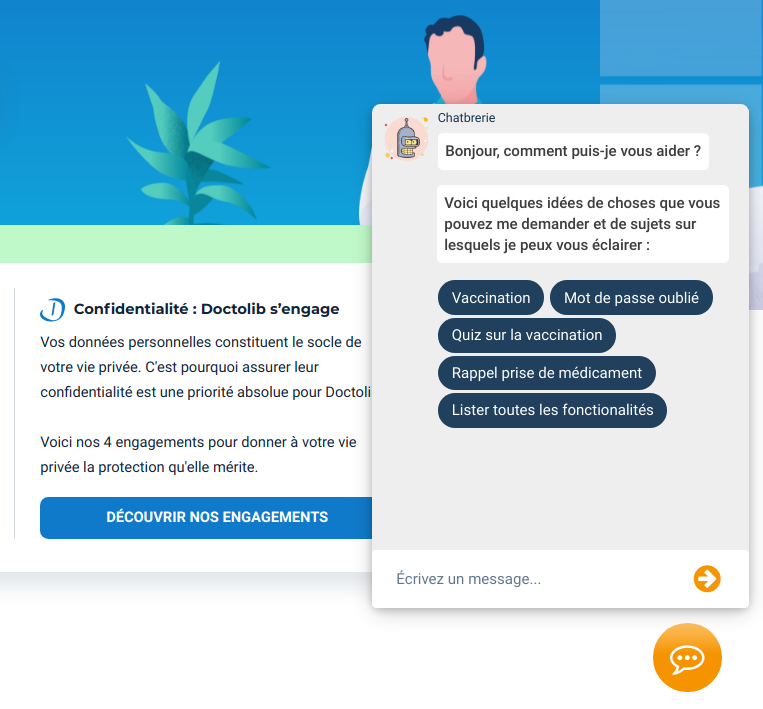

# Chatbrerie

<p align="center">
	
</p>


> A [Doctolib](https://www.doctolib.fr/) Chatbot project for EPITA, via a chrome extension

The extension is available on all *Chromium* based browser : Chromium, Google Chrome, Brave, Microsoft Edge, Vivaldi, ...

## Features

* Answer frequently asked questions
* Help Doctolib users to navigate the website
* Perfect integration on Doctolib pages
* Generate calendar reminders for medications
* Take a short quiz on vaccination, to learn all about it

## Installation and usage

### Chrome Webstore

The extension is not yet available on the Chrome Webstore, but should be in a close future. 

### Manual

1. Download the [last build](https://gitlab.com/guillaume.merle-epita/chatbrerie/-/jobs/artifacts/master/download?job=package)
2. Unzip the archive
3. Open `chrome://extensions` in your browser and enable *developer mode*
4. Select the `dist` folder with the *Load unpacked* option


Or if you want to build manually:

1. Clone this repository
2. Install dependencies (you'll need `npm` for that) : `./install.sh`
3. Build the extension : `npm run build` (this may take up to 30 seconds)
4. Open `chrome://extensions` in your browser and enable *developer mode*
5. Select the generated `dist` folder with the *Load unpacked* option


## Development / extend the chatbot

You'll need *python* (preferably 3.8, as *Keras* wont work with *python* 3.9 at this time) and *pip*.

Install the development dependencies : `./install.sh --dev`


Every time you make a modification to a file in the `src/`  or `data/` directories, you'll need to rebuild with `npm run build` and then reload the extension in the browser.

> If your modification **doesn't** imply a *JavaScript* file, you can use `npm run build:nopack` for a faster build


### Add new questions / answers

The questions are located in `data/questions/`.

They are registered in *JSON* files and grouped by category.

If the category you want to add a question to doesn't exist, just create a new file using this name format : `<category>.json`.

You can the add your question in the right file, following this template :

```json
{
    "intents": [
        {
            "tag": "your-tag",

            "patterns": ["Your question",
                         "a different formulation"],

            "responses": ["Your answer",
                          "Maybe another formulation for your answer"]
        }
    ]
}
```


After adding your question, the model needs to be retrained : run `npm run learn`

Build the extension and reload the extension it the browser to be able to use the chatbot with the newly added question.


### Add a quiz

The quizzes are located in `data/quizzes/`.

To add a new quiz, create a new file using this name format : `quiz-<subject>.json`.

You can then create questions using this template :

```json
[
    {
        "question": "Your question",
        "responses": [
            {"text": "Option 1"},
            {"text": "Option 2"},
            {"text": "Option 3"},
            {"text": "Option 4"}
        ],
        "valid": 0, // index of the correct answer
        "explanation": "The explanation"
    }
]
```


You'll also need to add a new *intent* in the `data/questions/quiz.json`, so that the user can access your quiz. Use a tag of the following format : `quiz-<subject>`.

Then run `npm run learn`, build and reload the extension.

